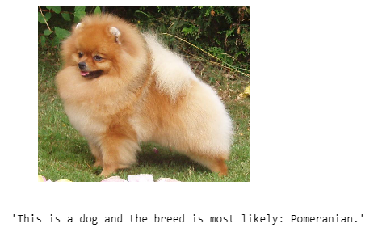
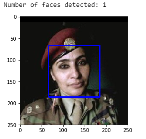
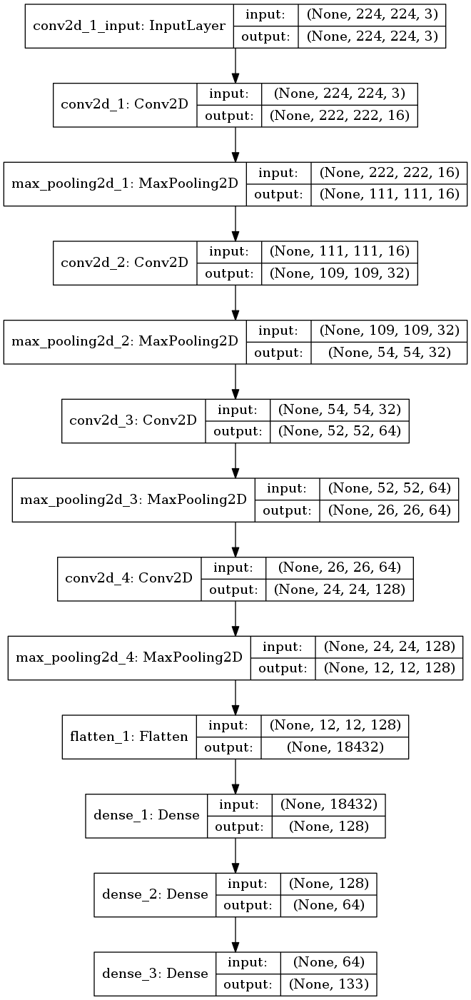
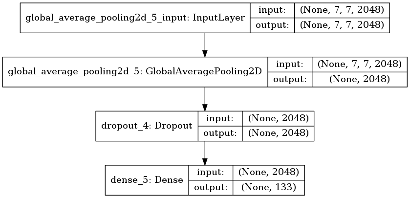
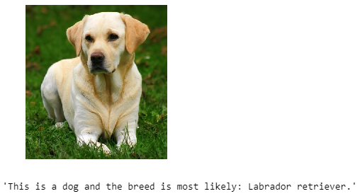
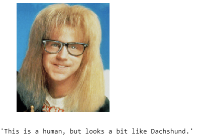
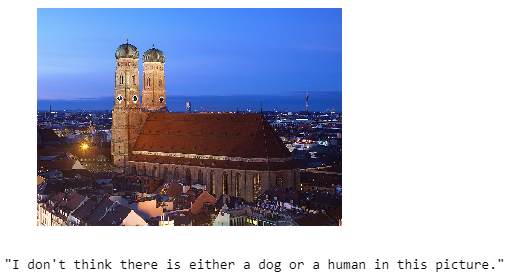

# Dog Breed Classifier

## Project Overview
This is the capstone project of the Udacity data science nanodegree.
You can read the original README and the instructions on how to run this project here: [https://github.com/udacity/dog-project](https://github.com/udacity/dog-project).

We are training Convolutional Neural Networks to identify dog-breeds based on an image. First one from scratch and in the second part we are using transfer learning using pre-trained models.

## Recognizing human faces
As an introduction, we are trying to identify human face in an image. 
For this task we are using OpenCV's implementation of Haar feature-based cascade classifiers to detect human faces in images.

You can find more about Haar-cascade detection here: 
[https://docs.opencv.org/trunk/db/d28/tutorial_cascade_classifier.html](https://docs.opencv.org/trunk/db/d28/tutorial_cascade_classifier.html)

## Recognizing dogs
We are using Resnet-50 pre-trained model to detect dogs. Resnet has been trained on the Imagenet dataset. 

## Building our own CNN
After consulting existing models for similar purposes I settled on an architecture of alternating convolution and maxpool layers, finishing with two fully connected layers like this: 

With this architecture after 30 epochs we are achieving around 8% prediction accuracy.

## Creating a CNN by transfer learning
In this part we are trying to use bottleneck features of pre-trained CNN models as inputs to create our own CNN using transfer learning.

Available models:
* VGG19
* Resnet-50
* Inception
* Xception

CNN architecture uses only one global averaging layer, dropout layer to reduce overfitting and a fully connected layer at the end:

Transfer learning proved by far superior with training times order of magnitude lower and accuracy reaching 85% with the Xception model.

## Examples

## Running the demo application
Included is the Python web app which enables a user to predict the breed of a dog picture based on the transfer learning Xception model.

### Required Python libraries
* Flask
* Keras
* Tensorflow

## Conclusion
The algorithm works very well and Xception based CNN was used for predictions.

Points of improvement in the future:

* getting more training samples would surely increase accuracy dramatically
* testing different CNN architectures, taking inspiration from scientfic papers
* tuning hyperparameters on cross-validated datasets and choosing the best performing one
* there might be merit in combining predictors based on each of the pre-trained models into an ensemble
